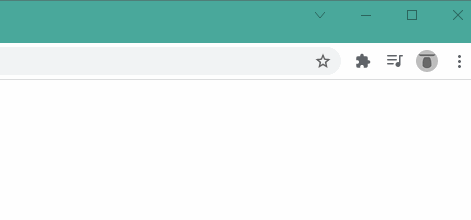

# Link To Phone
## What is it?
---
This extension allows you to send the link of the page you're viewing right to your phone using SMS.

## How do you use it?
Since this extension isn't verified by the Chrome Extension store yet, there are a few steps you'll need to complete in order to get started.

1) Sign-up at [https://www.link-to-phone.com](https://www.link-to-phone.com), it is very easy and just takes a moment.
1) Make sure you reply to the text we send you with *ACCEPT* or else you won't receive future messages.
1) Save this repository as a zip from Github or from the following [link](https://github.com/sellenth/Link-To-Phone/archive/refs/heads/main.zip)
1) Unzip the repository to a memorable location (keep in mind that the unzipped folder will likely have a nested folder of the same name)
1) Open your chrome extensions page by clicking the following [link](chrome://extensions/) (or by pressing Alt + e to open the Chrome menu and then select Settings -> Extensions)
1) Enable the "Developer mode" switch in the top right of the page
1) Click "Load unpacked" in the top left of the page
1) Select the unzipped, nested folder you unzipped in step 4 (example path: C:\Users\Foo\Downloads\link-to-phone-main\link-to-phone-main)
1) Pin the extension to your toolbar and right click to enter the options menu 

    
1) Enter the credentials you used for step 1
1) You're done 🎂

## Now what?
If you ever find yourself on your computer and you want to view whatever you're looking at on your phone, just click the L2P icon, click the big green button, and you're on your way!